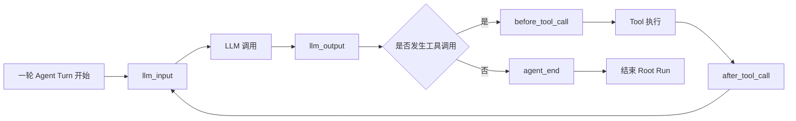

# OpenClaw LangSmith Tracing Plugin V1 PRD

## 1. 文档角色

本文档是 V1 产品范围、成功标准和关键产品决策的单一信息源。

本文档回答的问题是：

- 这个插件为什么要做
- V1 到底做什么，不做什么
- 对使用者而言，最小可用价值是什么
- 工程团队交付到什么程度算完成

实现细节、模块设计、状态管理、测试与开发顺序，见同目录的 [ARCHITECTURE.md](./ARCHITECTURE.md)。

## 2. 产品定义

`OpenClaw LangSmith Tracing Plugin` 是一个 **外部 OpenClaw 插件**。

它的作用是：

- 不修改 OpenClaw 核心源码
- 通过 OpenClaw 暴露的 Plugin hooks 监听运行阶段
- 在 LangSmith 中写出一棵基础 trace 树
- 让使用者能从 LangSmith 观察一轮 OpenClaw agent 执行

V1 的目标不是完整可观测性平台，而是 **最小可用 tracing 产品**。

## 3. 背景与机会

OpenClaw 已经有完整的 agent loop，但默认缺少面向 LangSmith 的标准 trace 输出。典型问题包括：

- 当 agent 回复异常时，不容易看出是模型阶段出错，还是工具阶段出错
- 一轮执行中发生过哪些工具调用、哪些模型调用，没有统一视图
- 当用户想分析失败率、延迟和 token 使用情况时，缺少标准可视化入口

LangSmith 的价值在于：

- 用树形结构展示一次执行链路
- 允许按 run、tag、metadata 检索和筛选
- 可以很快看到某轮调用的模型、工具、耗时和结果

因此 V1 的核心任务，是先把 OpenClaw 的主执行链路投影成 LangSmith 可理解的最小 trace 树。

## 4. 产品目标

### 4.1 核心目标

V1 必须让一次 OpenClaw agent turn 在 LangSmith 中呈现为：

- 一个 Root Run
- 零个或多个 LLM Child Runs
- 零个或多个 Tool Child Runs

### 4.2 使用者价值

V1 上线后，使用者至少能回答以下问题：

- 这轮 agent 执行是否成功
- 这轮使用了哪个 provider / model
- 这轮调用了哪些工具
- 哪一步大致失败
- 哪一类调用最耗时

### 4.3 工程目标

- 不修改 OpenClaw 核心源码
- 使用 OpenClaw 标准 Plugin hooks 实现
- 独立插件仓库开发与发布
- tracing 失败时必须 fail-open，不影响 OpenClaw 主流程

## 5. 非目标

以下内容明确不属于 V1：

- 覆盖 OpenClaw 的全部 hooks
- 覆盖 subagent、gateway、install、archive 等全部生命周期
- 覆盖底层 provider transport 的逐请求 tracing
- 完整支持 LangSmith 所有高级能力，如 distributed tracing、attachments、复杂 events
- 做复杂脱敏引擎或采样平台
- 做多环境配置矩阵和复杂管理后台

## 6. V1 范围

### 6.1 只接这五个 Plugin hooks

V1 只接入以下五个 hooks：

- `llm_input`
- `llm_output`
- `before_tool_call`
- `after_tool_call`
- `agent_end`

### 6.2 只输出三类 Run

V1 只输出三类 LangSmith runs：

- Root Run：一轮 agent turn
- LLM Child Run：一次模型调用
- Tool Child Run：一次工具调用

### 6.3 V1 数据最小化原则

V1 只上传最有业务价值、最有调试价值的信息，不追求全量镜像 OpenClaw 内部状态。

V1 重点保留：

- 身份锚点：`runId`、`sessionId`、`sessionKey`、`agentId`
- 模型信息：`provider`、`model`
- 工具信息：`toolName`、`params`、`result`、`error`、`durationMs`
- 结果信息：`assistantTexts`、`success`、`error`、`usage`、`durationMs`

V1 明确不追求：

- 完整上传 session 全量 transcript
- 完整上传所有中间内部对象
- 复杂事件时间线

### 6.4 当前实际展示语义（2026-04-11）

截至当前实现版本，V1 在 LangSmith 中的实际语义补充如下：

- Root Run 的 `inputs` 取自本轮首次 `llm_input`
- Root Run 的 `outputs` 取自本轮最后一次 `llm_output`
- Tool Run 当前挂在“当时活跃的 LLM Child Run”之下，而不是直接挂在 Root Run 下
- 同一轮 OpenClaw 外层 attempt 中，如果宿主内部发生了多次 assistant 回复与多次工具调用，当前 OpenClaw 仍可能只对插件暴露一对 `llm_input` / `llm_output`
- 在这种情况下，LangSmith 中会表现为“一个 LLM Child Run 下挂多个 Tool Child Runs，同时该 LLM Run 的 `assistantTexts` 中包含多段回复文本”

这意味着 V1 当前更适合回答：

- 这一轮 turn 是否成功
- 这一轮用到了哪些工具
- 这些工具大致发生在某次外层 LLM attempt 之下
- Root / LLM / Tool 的耗时、结果和错误是否正常

V1 当前不承诺回答：

- 每一次工具结果之后，agent 具体插入了哪一段中间回复
- 每一段中间回复与下一次工具调用的一一对应关系
- 宿主内部单次 LLM attempt 中更细粒度的“思考-动作-再思考”时间线

## 7. Agent-loop 总览图

这张图从产品视角展示：

- agent-loop 的主流程
- plugin hooks 位于哪些边界位置
- 以及为什么它本质上是一个 loop，而不是一条直线

```mermaid
flowchart LR
    G0[Gateway 启动]
    HGS[gateway_start]
    E0[消息进入]
    HREC[message_received / inbound_claim / before_dispatch]
    S0[Session 解析与创建]
    HSES0[session_start]
    M0[模型与 Prompt 准备]
    HMR[before_model_resolve]
    HPB[before_prompt_build / before_agent_start]
    R0[Reply 决策]
    HAR[before_agent_reply]
    HLI[llm_input]
    L0[LLM 调用]
    HLO[llm_output]
    D0{是否调用工具}
    HTI[before_tool_call]
    T0[Tool 执行]
    HTO[after_tool_call / tool_result_persist / before_message_write]
    SND0[发送准备]
    HMS0[message_sending]
    SND1[消息发送]
    HMS1[message_sent]
    E1[Turn 结束]
    HAEND[agent_end]

    G0 --> HGS --> E0 --> HREC --> S0 --> HSES0 --> M0 --> HMR --> HPB --> R0 --> HAR --> HLI --> L0 --> HLO --> D0
    D0 -->|是| HTI --> T0 --> HTO --> HLI
    D0 -->|否| SND0 --> HMS0 --> SND1 --> HMS1 --> E1 --> HAEND

    HAEND --> POST{是否触发后续维护}
    POST -->|压缩| HBC[before_compaction] --> C0[Compaction] --> HAC[after_compaction]
    POST -->|重置 / 轮转| HBR[before_reset] --> RST[Session 重置 / 轮转] --> HSES1[session_end] --> HSES2[session_start]

    HAEND --> SUBQ{是否产生 Subagent}
    SUBQ -->|是| HSS[subagent_spawning] --> HSD[subagent_delivery_target] --> HSP[subagent_spawned] --> HSE[subagent_ended]

    I0[安装流程] --> HINS[before_install]
    GX[Gateway 关闭] --> HSTP[gateway_stop]
```

读图说明：

- 一对 start/end hooks 必须位于流程的两个不同位置
- `llm_input` 在 LLM 调用前，`llm_output` 在 LLM 调用后
- `before_tool_call` 在 Tool 执行前，`after_tool_call` 在 Tool 执行后
- Tool 执行完成后会回到下一轮 `llm_input`，因此这是一条真正的 loop
- V1 真正关心的只有：`llm_input`、`llm_output`、`before_tool_call`、`after_tool_call`、`agent_end`

## 8. V1 极简图

下面这张图只保留 V1 真正接入的五个 hooks，用来帮助理解最小 trace 树是如何拼起来的。

V1 极简图说明：

- `llm_input`：开始一段 LLM Child Run，同时也是最适合“确保 Root Run 已存在”的位置
- `llm_output`：结束对应的 LLM Child Run
- `before_tool_call`：开始一段 Tool Child Run
- `after_tool_call`：结束对应的 Tool Child Run
- `agent_end`：结束 Root Run

## 9. V1 超级终极映射表

这张表是 V1 最关键的认知图。它回答的问题是：

- 每个 hook 在产品上扮演什么角色
- hook 提供的数据来自哪里
- 这些数据会映射到 RunTree 的哪个顶层字段
- 工程上要对这个 hook 做什么动作

说明：

- 表中“RunTree 顶层字段”指的是 LangSmith RunTree 直接接受的字段
- 表中“业务字段”指的是写进 `inputs` / `outputs` / `metadata` 内部的数据
- “插件动作”不是 RunTree 字段，而是实现逻辑

| Hook | 产品角色 | Hook 提供的数据 | 写入的 RunTree 顶层字段 | 顶层字段中的业务字段 | 插件动作 |
| --- | --- | --- | --- | --- | --- |
| `llm_input` | 一次 LLM 调用的开始点 | `event`: `runId`、`sessionId`、`provider`、`model`、`systemPrompt`、`prompt`、`historyMessages`、`imagesCount`；`ctx`: `agentId`、`sessionKey`、`sessionId`、`workspaceDir`、`messageProvider`、`trigger`、`channelId` | `name`、`run_type`、`inputs`、`metadata`、`tags`、父子关系 | `inputs.prompt`、`inputs.systemPrompt`、`inputs.historyMessages`、`inputs.imagesCount`；`metadata.runId`、`metadata.sessionId`、`metadata.sessionKey`、`metadata.agentId`、`metadata.channelId`、`metadata.trigger`；`tags=provider:* / model:*` | 确保 Root Run 已存在；创建 LLM Child Run；`postRun()` |
| `llm_output` | 一次 LLM 调用的结束点 | `event`: `assistantTexts`、`lastAssistant`、`usage`、以及 `runId/sessionId/provider/model`；`ctx`: `sessionKey`、`agentId`、`channelId` 等 | `outputs`、`metadata`、必要时 `error` | `outputs.assistantTexts`、`outputs.lastAssistant`；`metadata.usage`、`metadata.provider`、`metadata.model`、`metadata.sessionKey` | 找到对应的 LLM Child Run；`end()` + `patchRun()` |
| `before_tool_call` | 一次 Tool 调用的开始点 | `event`: `toolName`、`params`、`runId`、`toolCallId`；`ctx`: `agentId`、`sessionKey`、`sessionId`、`runId`、`toolCallId` | `name`、`run_type`、`inputs`、`metadata`、`tags`、父子关系 | `inputs.toolName`、`inputs.params`；`metadata.runId`、`metadata.sessionId`、`metadata.sessionKey`、`metadata.agentId`、`metadata.toolCallId`；`tags=tool:*` | 确保 Root Run 已存在；创建 Tool Child Run；`postRun()` |
| `after_tool_call` | 一次 Tool 调用的结束点 | `event`: `result`、`error`、`durationMs`、以及 `toolName/runId/toolCallId`；`ctx`: `sessionKey`、`agentId` 等 | `outputs`、`error`、`metadata` | `outputs.result`；`error`；`metadata.durationMs`、`metadata.toolCallId`、`metadata.sessionKey` | 找到对应的 Tool Child Run；`end()` + `patchRun()` |
| `agent_end` | 一整轮 Agent Turn 的结束点 | `event`: `messages`、`success`、`error`、`durationMs`；`ctx`: `runId`、`agentId`、`sessionKey`、`sessionId`、`workspaceDir`、`messageProvider`、`trigger`、`channelId` | Root Run 的 `outputs`、`error`、`metadata` | `outputs.success`、`outputs.error`、`outputs.durationMs`、`outputs.messageCount` 或摘要；`metadata.runId`、`metadata.sessionId`、`metadata.sessionKey`、`metadata.agentId`、`metadata.channelId`、`metadata.trigger` | 结束 Root Run；`end()` + `patchRun()`；清理插件内部状态 |

补充理解：

- `event` 更像“当前阶段的业务数据”
- `ctx` 更像“当前阶段所属的运行上下文”
- `event` 和 `ctx` 不是整轮 loop 共用的同一个活对象，而是系统在每个 hook 点位重新打包的一次性快照
- 要把多次 hook 串成一棵 RunTree，插件必须自己维护状态

## 10. 用户场景

### 场景 1：排查一次失败回复

用户在 OpenClaw 中发起一次请求，结果失败。

用户希望在 LangSmith 中看到：

- 本轮 agent turn 是否成功
- 失败前是否进行了模型调用
- 哪个工具报错
- 错误大致发生在哪一步

### 场景 2：分析 token 成本

用户希望知道：

- 某一轮 agent 执行中 LLM 消耗了多少 token
- 哪些模型调用最贵
- 这轮是否伴随大量工具调用

### 场景 3：分析执行结构

用户希望从业务视角理解一轮调用：

- 先进入模型阶段
- 是否发生工具调用
- 如果发生，工具和模型如何交替
- 最后 turn 是否成功结束

## 11. 用户故事

- 作为 OpenClaw 使用者，我希望在 LangSmith 中看到每一轮 agent 执行的根 trace，方便我按轮次排查问题。
- 作为 OpenClaw 使用者，我希望看到本轮用了哪个 provider 和 model，方便我分析模型行为差异。
- 作为 OpenClaw 使用者，我希望看到本轮工具调用列表，方便我知道 agent 做了什么动作。
- 作为 OpenClaw 使用者，我希望看到失败原因和大致耗时，方便我定位问题。
- 作为后续产品设计者，我希望插件架构可扩展，方便未来继续补 session、message、subagent 等 tracing 能力。

## 12. 功能需求

### 12.1 Root Run

系统应在一次 OpenClaw agent 执行期间维护一个 Root Run。

该 Root Run 代表：

- 一次 agent turn

V1 中 Root Run 至少要能表达：

- 这轮执行是谁
- 属于哪个 session
- 是否成功
- 总耗时多长

### 12.2 LLM Child Run

当 `llm_input` 触发时，系统应创建或准备一个 LLM Child Run。

V1 至少要表达：

- 这次用了哪个 provider / model
- 发给模型的 prompt 是什么
- 返回了什么文本
- usage 是多少

### 12.3 Tool Child Run

当 `before_tool_call` 触发时，系统应创建一个 Tool Child Run。

当 `after_tool_call` 触发时，系统应结束它。

V1 至少要表达：

- 调用了哪个 tool
- 入参是什么
- 结果是什么
- 是否报错
- 耗时多长

### 12.4 最小配置能力

V1 至少需要以下配置：

- `enabled`
- `langsmithApiKey`
- `projectName`
- `debug`

### 12.5 故障隔离

tracing 失败时：

- 不应导致 OpenClaw 主流程失败
- 不应阻断工具调用
- 不应阻断消息发送

## 13. 数据范围与产品决策

### 13.1 V1 必保留的数据

- `provider`
- `model`
- `prompt`
- `assistantTexts`
- `toolName`
- `params`
- `result`
- `error`
- `durationMs`
- `usage`
- `runId`
- `sessionId`
- `sessionKey`
- `agentId`

### 13.2 V1 明确不承诺的数据

以下数据在 V1 不承诺作为产品能力：

- 完整历史 transcript 的精确重建
- 每一步 token 流事件
- 分布式 trace headers
- 跨进程 run 传播
- 自动脱敏

### 13.3 Root Run 输出裁剪策略

V1 不要求把 `agent_end.messages` 原样上传到 Root Run。

V1 建议 Root Run 只保留：

- `success`
- `error`
- `durationMs`
- `messageCount` 或轻量摘要

原因：

- 控制 trace 体积
- 避免过度上传 transcript
- 保持产品范围稳定

## 14. 成功标准

V1 成功的定义是：

- 在 LangSmith 中可以稳定看到 OpenClaw agent trace 树
- 一条 trace 至少能串起 agent turn 与其下的 llm/tool 运行
- 常见成功和失败场景都能形成可读 trace
- 插件自身错误不影响 OpenClaw 正常运行

## 15. 验收标准

### 15.1 功能验收

- 触发一次普通 agent 执行后，LangSmith 中出现一条新的 Root Run
- 当该轮中发生 LLM 调用时，Root Run 下出现 LLM Child Run
- 当该轮中发生工具调用时，Root Run 下出现 Tool Child Run
- Root Run 在 `agent_end` 后显示完成状态
- 失败场景下 Root Run 或 Child Run 带有 error 信息

### 15.2 稳定性验收

- 当 LangSmith API 不可用时，OpenClaw 主流程仍可正常工作
- 当插件内部处理异常时，不阻断 agent/tool 正常执行
- 多轮连续运行时，内存中的 run 索引不会无限增长

## 16. 版本边界

V1 的边界是：

- 能跑通
- 能看懂
- 能排查

V1 不是最终形态。它的价值在于先建立一条稳定的产品主线，为后续增量能力打基础。

## 17. 后续扩展方向

V1 之后可按业务需求逐步扩展：

- 引入 `message_received` / `message_sent`
- 引入 `session_start` / `session_end`
- 引入 `before_prompt_build`
- 引入 `before_compaction` / `after_compaction`
- 引入 `subagent_*`
- 引入 `events`
- 引入 distributed tracing
- 引入脱敏与采样策略

补充说明：

- 当前最明确的下一步扩展方向，不是继续把更多普通 hook 接进来，而是引入 OpenClaw runtime 的细粒度事件流
- 目标不是伪造更多“LLM Child Runs”，而是在保留真实 LLM attempt 语义的前提下，额外重建更细的 assistant/tool 顺序结构
- 一个候选方案是在单个 `openclaw.llm` 节点下增加 `assistant_step` 子节点，再把对应工具挂到对应 step 下
- 该方案可以显著提升 LangSmith 上的可读性，但超出了 V1 当前最小实现边界，因此暂不纳入当前交付要求
